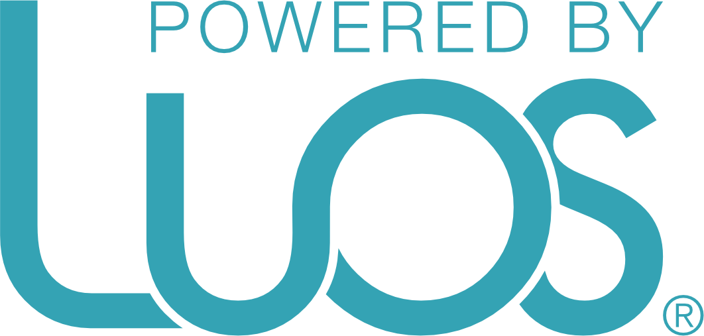

# Luos: robotic product development made easy
[](https://travis-ci.org/pollen-robotics/luos)

Luos is an end-to-end system to fully orchestrate your robot, all the way from hardware control to high level behaviors and Apps management.

It includes out of the box sensors acquisitions and filtering, drivers for advanced motor control for precise and eye-pleasing smooth motion. In the future, most commonly used robotic and AI algorithms will also be available.

Its sandboxed multi-layer architectures and elegant APIs allows for efficient and productive programming.

**[more information on our website>>](https://www.luos.io/)**

## Getting started

Follow our [tutorials](https://pollen-robotics.gitbooks.io/luos/) and go from zero to blinking an Led in Rust in under 30 minutes!

## Architecture

Luos is coded in [Rust](https://www.rust-lang.org) and built around 2 main concepts:
* **drivers** defines standardized API as Rust traits for common robotics parts (e.g. a servo motor, a position encoder, a distance sensor, etc.). This enforces compatibility amongst drivers and let you seamlessly switch from one actuator/sensor implementation to another without breaking the rest of your code.
* **core** represents a physical boards and its associated local drivers. It handles automatically the communication with the other cores - and thus the remote drivers - so you can develop your project with a modular approach.

## Development

Luos is lightweight, it can run on low-cost microcontrollers. We currently use the ARM Cortex M0 and develop on STM32F0 µC.

Discover our [development boards](https://pollen-robotics.gitbooks.io/luos/tutorials/00_development_boards.html) to test and use Luos.

## Example

A typical example of an app developed with Luos will look like this. You can define your own *drivers* based on the pre-defined traits or use already developed ones. Then, they can be easily composed to make complex behaviors.

```rust
extern crate luos;
use luos::{AngleEncoder, Motor};

extern crate luos_driver;
// We use a pre-defined driver for a known motor
use luos_driver::PololuluServoMotor;

// We define our implementation for our own encoder
struct MySpecificEncoder { ... }
impl AngleEncoder for MySpecificEncoder {
    // The API is standardized by traits
    // also enforcing units
    fn get_angle(&self) -> Degrees { ... }
}

fn main() {
    let encoder = MySpecificEncoder { pin: hal::GPIO::PA9 };
    let motor = PololuluServoMotor { pin: hal::GPIO::PB10 };

    asserv::loop(&encoder, &mut motor).run();
}
```

## Development

Luos is lightweight, it can run on low-cost microcontrollers.

We currently use the ARM Cortex M0 and develop on STM32F0 µC, you can use the following development board to test and use Luos.

- [Luos L0 (available soon)](https://www.luos.io/)
- [NUCLEO-F072RB](http://www.st.com/en/evaluation-tools/nucleo-f072rb.html)
- [32F072BDISCOVERY](http://www.st.com/en/evaluation-tools/32f072bdiscovery.html)

## Join the community

We'd love you to contribute to Luos!

The robotics community needs people from all backgrounds. We explicitly welcome contributions from people who have never contributed to open-source before: we were all beginners once! We can help build on a partially working pull request with the aim of getting it merged. Please read our [Contribution Guide](.github/contributing.md) and [Code of Conduct](CODE_OF_CONDUCT.md).

You can also contribute by becoming a patron of the project. It will give you exclusive access and content for [a monthly donation](https://www.patreon.com/bePatron?u=9305215).

<a href="https://www.patreon.com/pollenrobotics">  </a>

## License

This project is licensed under the Apache License, Version 2.0, ([LICENSE-APACHE](LICENSE)).

Please respect the attribution condition by adding a link to www.luos.io and the following *powered by luos* logo on any communication and documentation of your project.

<a href="doc/img/powered-by-luos.png"></a>

[This logo](doc/img/powered-by-luos.png) is also available in [black](doc/img/powered-by-luos-black.png) and [white](doc/img/powered-by-luos-white.png) for optimal integration in your design.
